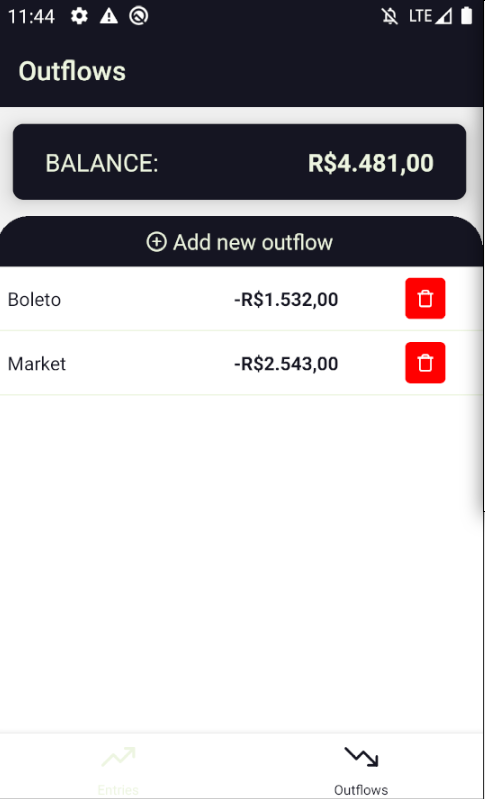

<h3 align="center">
    
</h3>

<p align="center">
   <a href="https://github.com/VictorGabrielMS">
    
  </a>
</p>

<p align="center">
  <a href="https://developer.mozilla.org/pt-BR/docs/Web/JavaScript">
    
  </a>
  <a href="https://www.typescriptlang.org/">
    
  </a>
  <a href="https://reactnative.dev/">
    
  </a>
</p>

## Finance List

- [About](#about)
- [Techs](#techs)
- [The Application](#application)
- [Clone and use for Free](#clone)

<a id="about"></a>

## :interrobang: About

<strong>Finance List</strong> a mobile app to manage your finances. Working with firebase for data storage and lottie for rendering json animations, the result of "my weekend code challenges" was this simple app that lets me manage my monetary inputs and outputs.

<a id="techs"></a>

## :diamonds: Techs

The project was developed with the technologies below:

- [Javacript](https://developer.mozilla.org/pt-BR/docs/Web/JavaScript)
- [Typescript](https://www.typescriptlang.org/)
- [Firebase](https://firebase.google.com/?hl=pt)
- [React Native](https://expo.io/)
- [React Native Firebase](https://rnfirebase.io/)
- [React Navigation](https://reactnavigation.org/)
- [React Native Lottie](https://www.npmjs.com/package/)
- [ESLint](https://eslint.org/)
- [Prettier](https://prettier.io/)

<a id="application"></a>

## :sparkles: The Application

<h1 align="center">
    
    
    
    
</h1>

<a id="clone"></a>

## :octocat:Clone this repo

1. Clone :

```sh
  $ git clone https://github.com/VictorGabrielMS/finance_list.git
```

2. Execute:

```sh
  $ npm install
  $ npm run android
```
